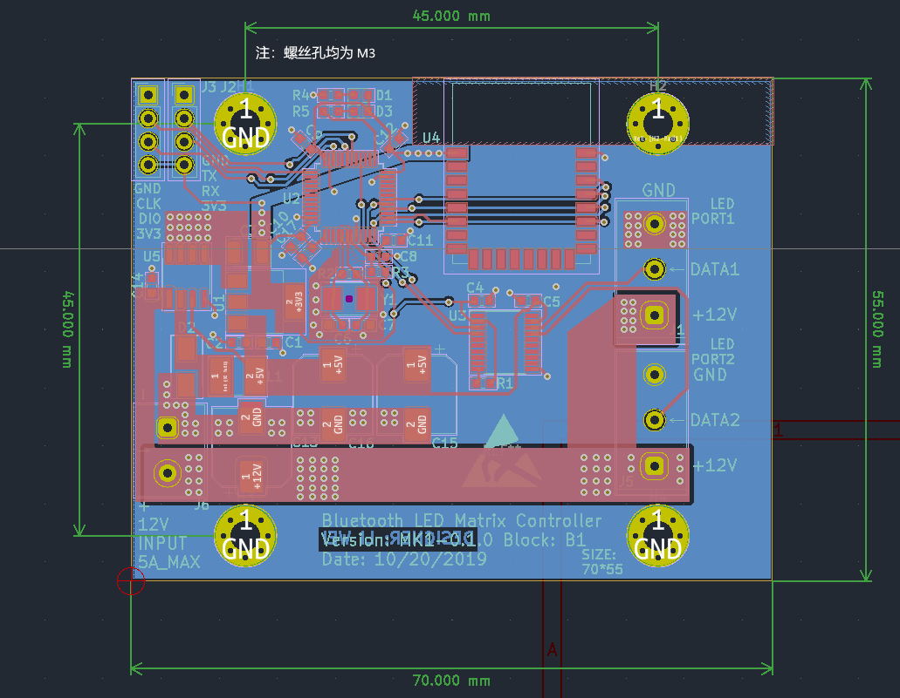

# 电气参数

* 额定电压：DC-12V
* 最大电压：24V（超过 12V 控制板可以承受，但可能烧毁灯珠）
* 额定电流：5A
* 支持的灯珠控制芯片： WS2812 系列
* 最大像素数（不包含常灭灯珠）：500
* 最大灯珠数（含常灭灯珠）：1000
* 通讯协议：BLE（低功耗蓝牙）

本系统硬件只支持连接 12V 的 WS2812 灯串，不支持 5V 的灯串，错误连接可能烧毁灯串，通电之前请先确认灯串参数。

!!! warning "安全警告"

    接入电源之前请先确认电源电压正常、已良好接地且正负极接线正确，否则可能造成设备烧毁或人身伤害。

## PCB 说明

PCB 顶部板载两个 LED 指示灯：

* 绿灯：常亮表示电源供应正常，不亮表示电源接反或电压不足，请尽快断电。
* 红灯：常亮表示故障，请尽快断电；慢速闪亮：板子正常，等待蓝牙连接；快速闪亮：已连接手机蓝牙。

### PCB 接口说明

### PCB 尺寸

# 设计说明

## LED 介绍

系统每个像素为一个灯珠，一个灯珠最终显示的颜色由红绿蓝三基色通道，每个通道共 256 级别亮度组成。

也就是说一个灯珠用 24 位表示，每个通道占一个字节共三个字节表示一个灯珠。

由于 RGB 三色是三个 LED 芯片集成在一个灯珠里分别点亮，但三色的芯片参数如电压等各不相同，因此以 #FFFFFF 方式点亮 LED 以后，颜色不是正白而是偏蓝属于正常情况。

!!! warning "警告"

    若灯珠数太多，可适当减小灯珠亮度以减小总电流，否则可能超过额定电流造成控制板烧毁、电线发热等。
    比如显示白色没必要全使用 #FFFFFF ，可以使用 #7F7F7F 同样可以显示灰色，但亮度小一倍电流也小一倍。

## 调色板

但是由于单片机内存非常有限，而且本项目并不需要 24 位色显示，故而采用调色板的设计节约内存。
这里规定一个调色板，调色板中有16个颜色，每个颜色有 24 位表示的正常 RGB，但具体系统设置像素点颜色时使用的是调色板的索引。

例如，调色板 `Palette[1] = RGB{0xFF, 0, 0}`，那么将一个灯珠的颜色设置为颜色索引 `1` 的时候，系统将使用调色板第一个颜色定义设置为红色。

调色板具有默认值，也可由客户端自行定义，见后续协议描述。

### 内置缺省调色板颜色定义

TODO

## 显示矩阵

本文的像素是指可以亮的灯珠，而不包含跳过的灯珠。对于客户端来说，提供的接口都是操作像素的，客户端无需考虑灯珠跳过的问题。

### 内置缺省矩阵参数：

* 每行像素数：11
* 行数：20
* 行内像素之间跳过灯珠数：1
* 两行之间跳过灯珠数：2