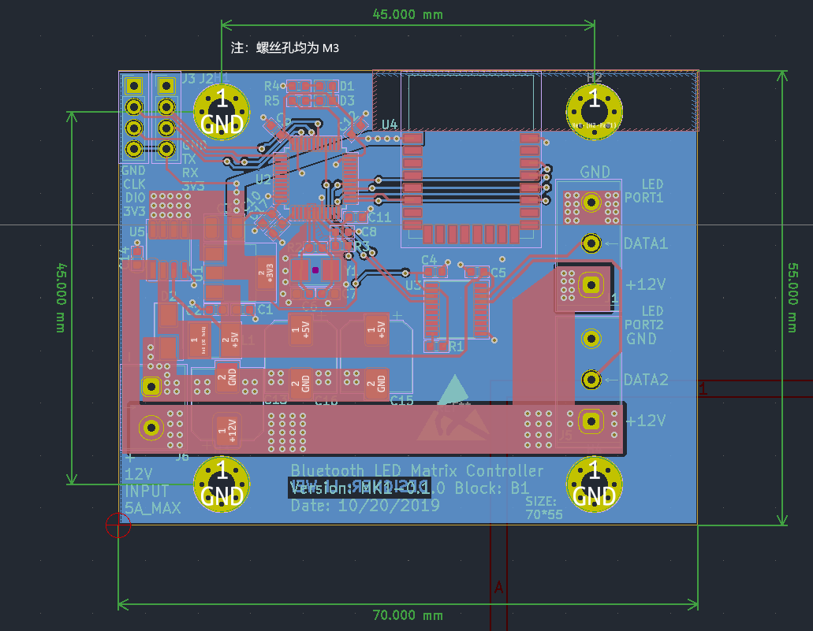

# 电气参数

* 额定电压：DC-12V
* 最大电压：24V（超过 12V 控制板可以承受，但可能烧毁灯珠）
* 额定电流：5A
* 支持的灯珠控制芯片： WS2812 系列
* 最大像素数（不包含常灭灯珠）：500
* 最大灯珠数（含常灭灯珠）：1000
* 通讯协议：BLE（低功耗蓝牙）

本系统硬件只支持连接 12V 的 WS2812 灯串，不支持 5V 的灯串，错误连接可能烧毁灯串，通电之前请先确认灯串参数。

!!! warning "安全警告"

    接入电源之前请先确认电源电压正常、已良好接地且正负极接线正确，否则可能造成设备烧毁或人身伤害。

# PCB 说明

PCB 顶部板载两个 LED 指示灯：

* 绿灯：常亮表示电源供应正常，不亮表示电源接反或电压不足，请尽快断电。
* 红灯：常亮表示故障，请尽快断电；慢速闪亮：板子正常，等待蓝牙连接；快速闪亮：已连接手机蓝牙。

## PCB 接口说明

## PCB 尺寸

